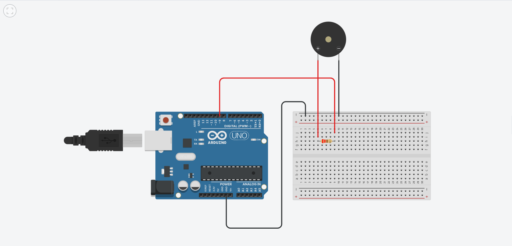

# arduino-morse-code
Audible representation of text in morse code using an arduino and a buzzer

## Hardware Requirements
- An Arduino(I used an Arduino Uno, any other is fine)
- Piezo buzzer
- 220 ohm resistor
- A breadboard
- Some breadboard cable(s)

## Connection Illustration

## Results
[Watch the demo here](https://youtu.be/RM6jr1HAcvE)

## Further work
- Include representation of punctuation marks and special characters
- Efficiency upgrades to lookup